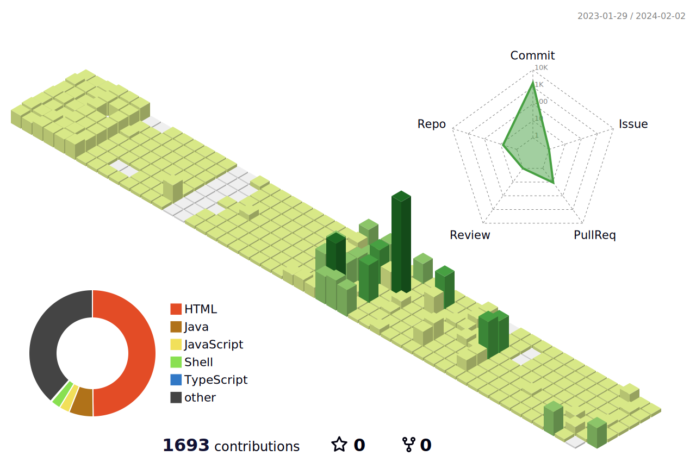

<p>
  <h1 align="center">Hola amigos, I'm Shivang 🤙🏻</h1>
</p>
<p>
  <h4 align="center"><b>"A good programmer is someone who always looks both ways before crossing a one-way street."</b></h4>
</p>

<p align="center">
    
</p>

<p align="center">
<br>
<a href="https://linkedin.com/in/shivang-mangal"></a>&nbsp;
<a href="mailto:shivangmangal@gmail.com?subject=Hola%20Shivang"></a>&nbsp;
<a href="https://github.com/shivang16"></a>&nbsp;
<a href="https://leetcode.com/baymax16/"></a>&nbsp;
<a href="https://www.codechef.com/users/shivang16m/"></a>&nbsp;
<a href="https://www.hackerrank.com/baymax16"></a>&nbsp;

</p>

<h3 align="left">Languages and Tools:</h3>

<a href="https://aws.amazon.com" target="_blank" rel="noreferrer">  </a> <a href="https://azure.microsoft.com/en-in/" target="_blank" rel="noreferrer">  </a> <a href="https://getbootstrap.com" target="_blank" rel="noreferrer">  </a> <a href="https://www.w3schools.com/cpp/" target="_blank" rel="noreferrer">  </a> <a href="https://www.w3schools.com/css/" target="_blank" rel="noreferrer">  </a> <a href="https://www.cypress.io" target="_blank" rel="noreferrer">  </a> <a href="https://www.docker.com/" target="_blank" rel="noreferrer">  </a> <a href="https://expressjs.com" target="_blank" rel="noreferrer">  </a> <a href="https://git-scm.com/" target="_blank" rel="noreferrer">  </a> <a href="https://www.w3.org/html/" target="_blank" rel="noreferrer">  </a> <a href="https://www.java.com" target="_blank" rel="noreferrer">  </a> <a href="https://developer.mozilla.org/en-US/docs/Web/JavaScript" target="_blank" rel="noreferrer">  </a> <a href="https://jestjs.io" target="_blank" rel="noreferrer">  </a> <a href="https://kubernetes.io" target="_blank" rel="noreferrer">  </a> <a href="https://www.linux.org/" target="_blank" rel="noreferrer">  </a> <a href="https://mochajs.org" target="_blank" rel="noreferrer">  </a> <a href="https://www.mongodb.com/" target="_blank" rel="noreferrer">  </a> <a href="https://www.mysql.com/" target="_blank" rel="noreferrer">  </a> <a href="https://nodejs.org" target="_blank" rel="noreferrer">  </a> <a href="https://www.postgresql.org" target="_blank" rel="noreferrer">  </a> <a href="https://postman.com" target="_blank" rel="noreferrer">  </a> <a href="https://www.python.org" target="_blank" rel="noreferrer">  </a> <a href="https://reactjs.org/" target="_blank" rel="noreferrer">  </a> <a href="https://redis.io" target="_blank" rel="noreferrer">  </a> <a href="https://www.selenium.dev" target="_blank" rel="noreferrer">  </a> <a href="https://spring.io/" target="_blank" rel="noreferrer">  </a> <a href="https://www.typescriptlang.org/" target="_blank" rel="noreferrer">  </a> <!-- Repeat the above line for each image and link -->


### :zap: Github Stats

<br>
<p align="center">
</p>
<br>

<!--START_SECTION:waka-->
📊 **This Week I Spent My Time On** 

```text
🕑︎ Time Zone: Europe/Warsaw

💬 Programming Languages: 
Java                     15 hrs 25 mins      ██████████████████████░░░   88.72 % 
YAML                     1 hr 3 mins         ██░░░░░░░░░░░░░░░░░░░░░░░   06.05 % 
XML                      39 mins             █░░░░░░░░░░░░░░░░░░░░░░░░   03.80 % 
JSON                     9 mins              ░░░░░░░░░░░░░░░░░░░░░░░░░   00.89 % 
GitIgnore file           4 mins              ░░░░░░░░░░░░░░░░░░░░░░░░░   00.42 % 

🔥 Editors: 
Intellijidea             17 hrs 23 mins      █████████████████████████   100.00 % 
```

**I Mostly Code in C++** 

```text
JavaScript               4 repos             ████░░░░░░░░░░░░░░░░░░░░░   16.67 % 
Java                     3 repos             ███░░░░░░░░░░░░░░░░░░░░░░   12.50 % 
TypeScript               2 repos             ██░░░░░░░░░░░░░░░░░░░░░░░   08.33 % 
HTML                     2 repos             ██░░░░░░░░░░░░░░░░░░░░░░░   08.33 % 
Shell                    1 repo              █░░░░░░░░░░░░░░░░░░░░░░░░   04.17 % 
```


 Last Updated on 02/02/2024 12:10:06 UTC
<!--END_SECTION:waka-->
<!--

-->

